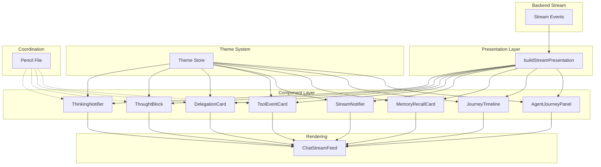

# Design Document: Chat Visualization V2

## Overview

Este documento descreve o design técnico para a melhoria da visualização do Chat principal (chat-visualization-v2). O sistema implementa uma nova geração de componentes visuais (V2) que melhoram significativamente a experiência de visualização das interações entre o Orquestrador e os Agentes delegados.

### Objetivos

- Reduzir a poluição visual através de componentes mais compactos e informativos
- Implementar animação token-by-token para thinking states
- Criar sistema de expansão/colapso para Thought Blocks e Tool Calls
- Implementar Agent Journey expandível com timeline detalhada
- Suportar temas light e dark de forma consistente
- Integrar todos os componentes através do arquivo Pencil como ponto central de coordenação

### Escopo

O sistema abrange:
- Componentes visuais V2 (Thinking States, Delegation Cards, Notifiers Pills, etc.)
- Sistema de animação progressiva (token-by-token)
- Sistema de expansão/colapso interativo
- Agent Journey com visualização lateral
- Integração com sistema de temas
- Coordenação através do arquivo Pencil

## Architecture

### High-Level Architecture

O sistema segue uma arquitetura de apresentação baseada em eventos de stream, onde:

1. **Stream Events Layer**: Eventos brutos do backend (orchestrator_thinking, agent_delegation_start, tool_call, etc.)
2. **Presentation Layer**: Transformação de eventos em estruturas de apresentação (buildStreamPresentation)
3. **Component Layer**: Componentes React especializados para cada tipo de visualização
4. **Theme Layer**: Sistema de temas com suporte a light/dark mode
5. **Coordination Layer**: Arquivo Pencil como ponto central de integração


### Architecture Diagram



### Component Hierarchy


```
ChatStreamFeed (Container)
├── AgentTodoList (Conditional: isStreaming && delegations.length > 0)
├── ThinkingNotifierRow (Always visible)
│   └── ThinkingNotifier[] (One per agent type)
├── StreamNotifier (Conditional: isStreaming && !hasHistory)
├── ThoughtBlock[] (Dynamic: one per thought event)
├── DelegationCard[] (Dynamic: one per delegation)
├── AgentJourneyPanel (Conditional: openDelegationId !== null)
│   └── JourneyTimeline (Embedded)
├── ToolEventCard[] (Dynamic: one per tool event)
├── MemoryRecallCard[] (Dynamic: one per memory event, theme-dependent)
├── StreamNotifier[] (Dynamic: one per notifier event)
├── DiagnosticNotifier[] (Dynamic: one per error)
├── ChatDiagnostic (Conditional: scopeEscape || slowRun)
└── JourneyTimeline (Conditional: journey.steps.length > 0)
```

### Data Flow

1. **Event Reception**: Backend envia eventos via stream (SSE/WebSocket)
2. **Event Parsing**: `buildStreamPresentation` transforma eventos brutos em estruturas tipadas
3. **State Management**: React state gerencia expansão/colapso e seleção de journeys
4. **Component Rendering**: Componentes React renderizam baseado nas estruturas de apresentação
5. **User Interaction**: Cliques e interações atualizam estado local (expansão, seleção)
6. **Theme Application**: Sistema de temas aplica cores e estilos consistentemente

## Components and Interfaces

### Core Components

#### 1. ThinkingNotifier / ThinkingNotifierRow

**Purpose**: Indica quais agentes estão ativos ou aguardando durante a execução.

**Interface**:
```typescript
interface ThinkingNotifierProps {
  agentType: MindflowV2AgentType;
  active?: boolean;
  status?: string;
  className?: string;
}

interface ThinkingNotifierRowProps {
  activeAgents: MindflowV2AgentType[];
  statuses?: Partial<Record<MindflowV2AgentType, string>>;
  className?: string;
}
```

**Behavior**:
- Exibe pills compactos para cada tipo de agente (orchestrator, analyst, coder, researcher)
- Pills ativos mostram animação de pulso e cor de accent do agente
- Pills inativos mostram estado "waiting" com opacidade reduzida
- Status é formatado automaticamente (thinking → "pensando", waiting → "aguardando")


#### 2. ThoughtBlock

**Purpose**: Exibe o raciocínio do agente com estado expansível e animação token-by-token.

**Interface**:
```typescript
interface ThoughtBlockProps {
  agentType: MindflowV2AgentType;
  title?: string;
  status?: string;
  content: string;
  summary?: string;
  defaultExpanded?: boolean;
  className?: string;
}
```

**Behavior**:
- Colapsado por padrão (exceto para decisões ou conteúdo curto < 300 chars)
- Exibe preview do conteúdo quando colapsado (primeiros 60 caracteres)
- Inclui Reasoning Depth Bar (3 segmentos baseados no tamanho do conteúdo)
- Suporta formatação rica via RichText component (negrito, sublinhado, colunas)
- Animação token-by-token durante geração (via framer-motion)
- Clique no header expande/colapsa o bloco

**Visual Elements**:
- Synapse visual (3 nodes + 2 links) com cor de accent do agente
- Header com nome do agente, status e chevron
- Body com conteúdo formatado (quando expandido)
- Preview com depth bar (quando colapsado)

#### 3. DelegationCard

**Purpose**: Resume o trabalho delegado, o agente alvo e o estado da orquestração.

**Interface**:
```typescript
interface DelegationCardProps {
  title?: string;
  subtitle?: string;
  status?: string;
  pipeline?: string;
  summary?: string;
  agents: DelegationAgentRow[];
  variant?: 'simple' | 'rich';
  accent?: string;
  onOpenJourney?: () => void;
  className?: string;
}

interface DelegationAgentRow {
  name: string;
  role: string;
  status: string;
  accent?: string;
  agentType?: MindflowV2AgentType;
}
```

**Variants**:
- **Simple**: Versão compacta para todo-list (origin → target com status badge)
- **Rich**: Versão completa com header, lista de agentes, summary e botão de journey

**Behavior**:
- Exibe lista de agentes delegados com status individual
- Botão "percurso ↗" abre AgentJourneyPanel lateral
- Summary bar mostra estado atual da delegação
- Indicador de progresso em tempo real


#### 4. ToolEventCard

**Purpose**: Expõe chamadas de ferramenta, parâmetros e resultados em tempo real.

**Interface**:
```typescript
interface ToolEventCardProps {
  toolName: string;
  status: 'running' | 'completed' | 'error' | 'collapsed';
  args?: unknown;
  result?: unknown;
  error?: string;
  elapsed?: string;
  agentName?: string;
  className?: string;
}
```

**Behavior**:
- Colapsado automaticamente quando concluído (status: 'collapsed')
- Expandido durante execução (status: 'running')
- Clique expande/colapsa o card
- Exibe parâmetros sempre visíveis
- Exibe resultado apenas quando expandido e status === 'completed'
- Exibe erro apenas quando expandido e status === 'error'
- Ícones dinâmicos: CheckCircle2 (completed), AlertCircle (error), Loader2 (running)

**Specialized Visualizations**:
- **Read Tool**: Exibe path e dados estruturados
- **Shell Tool**: Visualização apropriada para comandos shell
- **Grep_Search Tool**: Visualização apropriada para resultados de busca
- **Tool_Call_Group**: Agrupa sequências de tool calls relacionados

#### 5. StreamNotifier

**Purpose**: Mostra avisos de alto sinal (routing, conclusão, falhas).

**Interface**:
```typescript
interface StreamNotifierProps {
  title: string;
  status: string;
  message?: string;
  detail?: string;
  tone?: MindflowV2Tone;
  className?: string;
}

type MindflowV2Tone = 'accent' | 'info' | 'success' | 'warning' | 'error' | 'neutral';
```

**Behavior**:
- Tom (tone) determina cor e estilo visual
- Pulso animado para indicar atividade
- Deduplicação automática (mesma key dentro de 2s window)
- Limite de 6 notifiers mais recentes (NOTIFIER_CAP)

**Tone Mapping**:
- `accent`: routing, decision, thinking, activate
- `info`: memory, context
- `success`: complete, done, success, loaded
- `warning`: warn, slow, scope, fallback
- `error`: error, fail, failure


#### 6. MemoryRecallCard

**Purpose**: Mostra memória recuperada, referências de contexto e origem do recall.

**Interface**:
```typescript
interface MemoryRecallCardProps {
  source: 'vector' | 'database';
  status: string;
  label?: string;
  count?: number;
  detail?: string;
  agentName?: string;
  done?: boolean;
  className?: string;
}
```

**Behavior**:
- **Theme-dependent**: Apenas renderizado em dark theme
- Source determina ícone (Database vs Search) e tom (info vs accent)
- Exibe contagem de registros/fragmentos recuperados
- Preview com detalhes da recuperação

**Theme Rules**:
- Dark theme: Renderiza normalmente
- Light theme: Não renderiza (retorna null)

#### 7. AgentTodoList

**Purpose**: Exibe lista de tarefas do Orquestrador durante execução.

**Interface**:
```typescript
interface AgentTodoListProps {
  delegations: DelegationCardProps[];
  className?: string;
}
```

**Behavior**:
- **Theme-dependent**: Apenas renderizado em dark theme
- **Conditional**: Apenas quando isStreaming && delegations.length > 0
- Exibe delegations em variant='simple'
- Layout flexível com wrap (flex: 1 1 200px)
- Badge com contagem de agentes e status "live"

#### 8. AgentJourneyPanel

**Purpose**: Visualização lateral expandida da sequência de ações executadas por um Agente delegado.

**Interface**:
```typescript
interface AgentJourneyPanelProps {
  delegation: DelegationCardProps;
  steps: JourneyStep[];
  isStreaming?: boolean;
  onClose: () => void;
}

interface JourneyStep {
  id: string;
  title: string;
  detail: string;
  status: 'live' | 'done' | 'queued' | 'waiting' | 'error';
  agentType?: MindflowV2AgentType;
  meta?: string;
}
```

**Behavior**:
- Painel lateral fixo (380px width) com backdrop
- Inicia com "Delegation Received" na timeline
- Exibe tool calls e thinking em tempo real
- Área limitada com scroll vertical
- Indicador verde e resumo quando agente finaliza
- Suporta múltiplos painéis lado a lado (via state management)
- Animação de entrada/saída (slide from right)


#### 9. JourneyTimeline

**Purpose**: Agrupa a jornada do trabalho em etapas, delegações e marcos da execução.

**Interface**:
```typescript
interface JourneyTimelineProps {
  title?: string;
  subtitle?: string;
  steps: JourneyStep[];
  summary?: string;
  durationLabel?: string;
  liveLabel?: string;
  activeStepId?: string;
  className?: string;
}
```

**Behavior**:
- Layout dual: rail (lista de steps) + stage (visualização detalhada)
- Rail permite seleção de step individual
- Stage exibe step ativo com detalhes completos
- Timeline vertical com dots numerados e linhas conectoras
- Status visual: live (pulsing), done (green), waiting (muted), error (red)
- Footer com badge "ao vivo", duração e summary

### Supporting Types and Utilities

#### MindflowV2AgentType

```typescript
type MindflowV2AgentType = 'orchestrator' | 'analyst' | 'coder' | 'researcher';
```

#### MindflowV2AgentTheme

```typescript
interface MindflowV2AgentTheme {
  label: string;        // "Orchestrator", "Analyst", etc.
  shortLabel: string;   // "Orch", "Analyst", etc.
  accent: string;       // Cor principal (#0D6E6E, #5B6ABF, etc.)
  soft: string;         // Cor suave para backgrounds (#E8F4F4, etc.)
  muted: string;        // Cor escura para contraste (#0D2E2E, etc.)
}
```

**Theme Mapping**:
- `orchestrator`: teal (#0D6E6E)
- `analyst`: blue (#5B6ABF)
- `coder`: orange (#C75D2C)
- `researcher`: green (#2D8F5E)

#### Utility Functions

```typescript
// Resolve agent type from string
function resolveMindflowV2AgentType(raw: string): MindflowV2AgentType

// Get theme for agent
function getMindflowV2AgentTheme(raw: string): MindflowV2AgentTheme

// Resolve tone from status/kind
function resolveMindflowV2Tone(kind: string): MindflowV2Tone

// Format duration (ms → "1m 23s")
function formatMindflowV2Duration(milliseconds: number): string

// Format and summarize values
function formatMindflowV2Value(value: unknown): string
function summarizeMindflowV2Value(value: unknown, maxLength?: number): string
```


## Data Models

### Stream Event Model

```typescript
interface StreamEvent {
  id?: string;
  type: string;
  data: string;
  meta?: Record<string, unknown> | null;
}
```

**Event Types**:
- `orchestrator_thinking_start`: Orquestrador inicia processamento
- `orchestrator_thinking`: Pensamento do orquestrador
- `orchestrator_decision`: Decisão de roteamento
- `orchestrator_thinking_end`: Orquestrador finaliza processamento
- `agent_delegation_start`: Início de delegação para agente
- `agent_delegation_complete`: Conclusão de delegação
- `specialist_activation`: Ativação de agente especialista
- `tool_call`: Chamada de ferramenta
- `tool_result`: Resultado de ferramenta
- `tool_operation_start`: Início de operação de ferramenta
- `tool_operation_complete`: Conclusão de operação de ferramenta
- `agent_step`: Passo de execução do agente
- `notifier`: Notificação geral
- `error`: Erro de execução
- `reflection_mode_start`: Início de modo de reflexão
- `reflection_mode_end`: Fim de modo de reflexão

### Presentation Model

```typescript
interface StreamPresentation {
  activeAgents: MindflowV2AgentType[];
  thinkingStatuses: Partial<Record<MindflowV2AgentType, string>>;
  thoughts: ParsedStreamThought[];
  delegations: ParsedStreamDelegation[];
  toolEvents: ParsedStreamToolEvent[];
  notifiers: ParsedStreamNotifier[];
  memoryEvents: ParsedStreamMemory[];
  journey: ParsedStreamJourney;
  errors: StreamError[];
  diagnostics: StreamDiagnostics;
}
```

**Transformation Logic** (`buildStreamPresentation`):
1. Itera sobre todos os eventos do stream
2. Mantém estado acumulado (activeAgents, delegations map, toolEvents map)
3. Filtra eventos de infraestrutura (INFRA_STEP_PATTERNS)
4. Deduplica notifiers (2s window)
5. Aplica limite de notifiers (NOTIFIER_CAP = 6)
6. Constrói journey steps apenas para eventos de negócio
7. Detecta scope escape de decisões
8. Retorna estrutura de apresentação completa

### State Management

```typescript
// ChatStreamFeed local state
const [liveTick, setLiveTick] = useState(0);
const [openDelegationId, setOpenDelegationId] = useState<string | null>(null);

// ThoughtBlock local state
const [expanded, setExpanded] = useState(defaultExpanded);

// ToolEventCard local state
const [expanded, setExpanded] = useState(status !== 'collapsed');

// JourneyTimeline local state
const [selectedStepId, setSelectedStepId] = useState<string | null>(null);
```

**State Update Patterns**:
- `liveTick`: Atualizado a cada 1s quando isStreaming (para elapsed labels)
- `openDelegationId`: Atualizado via onOpenJourney callback do DelegationCard
- `expanded`: Toggle via onClick handlers
- `selectedStepId`: Atualizado via onClick nos rail cards


### Animation Model

#### Token-by-Token Animation

**Implementation Strategy**:
- Utiliza framer-motion para animações declarativas
- Conteúdo é renderizado progressivamente durante streaming
- Animação de entrada (opacity 0→1, y 8→0) para novos componentes
- Duração padrão: 0.18s para componentes pequenos, 0.2s para cards maiores

**Animation Variants**:
```typescript
// Component entry
initial={{ opacity: 0, y: 8 }}
animate={{ opacity: 1, y: 0 }}
transition={{ duration: 0.18 }}

// Panel slide-in
initial={{ x: 380, opacity: 0 }}
animate={{ x: 0, opacity: 1 }}
exit={{ x: 380, opacity: 0 }}
transition={{ duration: 0.22, ease: 'easeOut' }}

// Content expansion
initial={{ opacity: 0, y: -4 }}
animate={{ opacity: 1, y: 0 }}
transition={{ duration: 0.18 }}
```

**Progressive Rendering**:
- Backend envia eventos incrementalmente via SSE
- Frontend adiciona novos componentes ao array conforme eventos chegam
- React renderiza novos componentes com animação de entrada
- Conteúdo de texto é atualizado progressivamente (não caractere-por-caractere, mas evento-por-evento)

#### Pulse Animation

**CSS Implementation**:
```css
@keyframes pulse {
  0%, 100% { opacity: 1; }
  50% { opacity: 0.5; }
}

.routing-pill-dot {
  animation: pulse 2s cubic-bezier(0.4, 0, 0.6, 1) infinite;
  animation-play-state: var(--animation-state, paused);
}
```

**Usage**:
- ThinkingNotifier dots quando active=true
- StreamNotifier pulse indicator
- AgentJourneyPanel tracker pill

## Correctness Properties

*A property is a characteristic or behavior that should hold true across all valid executions of a system—essentially, a formal statement about what the system should do. Properties serve as the bridge between human-readable specifications and machine-verifiable correctness guarantees.*


### Property 1: Event Filtering During Message Sending

*For any* stream of events during message sending, unnecessary events and notifiers should be filtered out and not rendered in the chat feed.

**Validates: Requirements 1.3**

### Property 2: Thinking State Visibility

*For any* orchestrator processing state, a ThinkingNotifier component with active=true should be rendered in the chat feed.

**Validates: Requirements 3.1**

### Property 3: Token-by-Token Animation

*For any* thought content being generated, the content should be rendered progressively with animation, never displayed completely and instantaneously.

**Validates: Requirements 3.2**

### Property 4: Thought Block Auto-Collapse

*For any* thought block that completes, the block should automatically transition to collapsed state (expanded=false).

**Validates: Requirements 3.4**

### Property 5: Agent Visual Differentiation

*For any* active agent, the system should render a unique visual indicator with consistent theme colors (accent, soft, muted) that remains unchanged throughout the agent's execution.

**Validates: Requirements 4.1, 4.2, 4.3**

### Property 6: Agent Message Card Rendering

*For any* message sent by an agent, the message should be rendered in a message card component that includes the agent's visual identification (name, color, icon).

**Validates: Requirements 5.1, 5.2**

### Property 7: Orchestrator Visual Priority

*For any* collection of message cards, orchestrator cards should appear before delegated agent cards in the rendering order.

**Validates: Requirements 5.3**


### Property 8: Delegation Card Creation

*For any* delegation event from the orchestrator, a DelegationCard component should be rendered in the chat feed.

**Validates: Requirements 6.1**

### Property 9: Delegation Card Agent Information

*For any* delegation card, the card should contain the agent type information of the delegated agent.

**Validates: Requirements 6.2**

### Property 10: Delegation Card Real-Time State

*For any* delegation card, the displayed state should match the current delegation state from the stream events.

**Validates: Requirements 6.3**

### Property 11: Delegation Card UI Elements

*For any* delegation card, the card should include both a summary bar element and a progress indicator element.

**Validates: Requirements 6.4, 6.5**

### Property 12: Routing Notifier State Transition

*For any* routing event, a notifier pill should be created with status "Routing" that transitions to "Delegated" when delegation occurs.

**Validates: Requirements 7.1**

### Property 13: Read Operation Notifier

*For any* read operation event, a notifier pill with status "Read" should be rendered.

**Validates: Requirements 7.2**

### Property 14: Success Operation Notifier

*For any* successful operation completion event, a notifier pill with status "Success" should be rendered.

**Validates: Requirements 7.3**

### Property 15: Error Operation Notifier

*For any* error event, a notifier pill with status "Error" should be rendered.

**Validates: Requirements 7.4**


### Property 16: Memory Recall Component Creation

*For any* memory recall event, a MemoryRecallCard component should be rendered in the chat feed.

**Validates: Requirements 8.1**

### Property 17: Memory Recall Dark Theme Support

*For any* memory recall component in dark theme, the component should render with appropriate dark theme styling.

**Validates: Requirements 8.2**

### Property 18: Memory Recall Light Theme Exclusion

*For any* memory recall event when light theme is active, no MemoryRecallCard component should be rendered.

**Validates: Requirements 8.3**

### Property 19: Todo List Creation

*For any* task plan creation event from the orchestrator, an AgentTodoList component should be rendered.

**Validates: Requirements 9.1**

### Property 20: Todo List Dark Theme Support

*For any* todo list component in dark theme, the component should render with appropriate dark theme styling.

**Validates: Requirements 9.2**

### Property 21: Todo List Light Theme Exclusion

*For any* task plan event when light theme is active, no AgentTodoList component should be rendered.

**Validates: Requirements 9.3**

### Property 22: Todo List Real-Time Updates

*For any* todo list, when a task completion event occurs, the todo list state should update to reflect the completion.

**Validates: Requirements 9.4**

### Property 23: Thought Block Auto-Creation

*For any* thought generation event from the orchestrator, a ThoughtBlock component should be automatically created.

**Validates: Requirements 10.1**


### Property 24: Thought Block Rich Text Support

*For any* thought block content containing formatting markers (bold, underline, columns), the rendered output should preserve and display the formatting correctly.

**Validates: Requirements 10.2**

### Property 25: Thought Block Default Collapsed State

*For any* newly created thought block (except decisions or content < 300 chars), the initial state should be collapsed (expanded=false).

**Validates: Requirements 10.3**

### Property 26: Thought Block Click Expansion

*For any* thought block, clicking the block should toggle the expanded state (collapsed ↔ expanded).

**Validates: Requirements 10.4**

### Property 27: Thought Chain Grouping

*For any* sequence of related thought events, the thoughts should be grouped together in a Thought Chain structure.

**Validates: Requirements 11.1**

### Property 28: Thought Chain Content Filtering

*For any* thought chain, the chain should not include "Delegated" indicators, reasoning depth indicators, or thought summary elements.

**Validates: Requirements 11.3, 11.4, 11.5**

### Property 29: Delegation Card Click Expansion

*For any* delegation card, clicking the card should trigger the expansion of the Agent Journey panel.

**Validates: Requirements 12.1**

### Property 30: Agent Journey Initial Step

*For any* expanded agent journey, the timeline should start with a "Delegation Received" step.

**Validates: Requirements 12.2**

### Property 31: Agent Journey Real-Time Updates

*For any* agent journey, when tool call or thinking events occur, the journey should update to display these events.

**Validates: Requirements 12.3**


### Property 32: Agent Journey Completion Indicator

*For any* agent journey where the agent has finalized, the journey should display a success indicator (green) and a summary.

**Validates: Requirements 12.5**

### Property 33: Multiple Agent Journey Support

*For any* collection of delegation cards, multiple agent journey panels should be able to be rendered simultaneously side by side.

**Validates: Requirements 12.6**

### Property 34: Running Tool Call Partial Results

*For any* tool call with status='running', the tool call card should display partial results in a visible state.

**Validates: Requirements 13.1**

### Property 35: Completed Tool Call Auto-Collapse

*For any* tool call that completes, the tool call card should automatically transition to collapsed state.

**Validates: Requirements 13.2**

### Property 36: Tool Call Click Expansion

*For any* collapsed tool call card, clicking the card should expand it to show the complete result.

**Validates: Requirements 13.3**

### Property 37: Read Tool Call Visualization

*For any* tool call of type Read, the rendered card should display the file path and structured result data.

**Validates: Requirements 14.1**

### Property 38: Shell Tool Call Visualization

*For any* tool call of type Shell, the rendered card should display appropriate visualization for shell commands.

**Validates: Requirements 14.2**

### Property 39: Grep Search Tool Call Visualization

*For any* tool call of type Grep_Search, the rendered card should display appropriate visualization for search results.

**Validates: Requirements 14.3**


### Property 40: Tool Call Group Support

*For any* sequence of related tool calls, the system should support grouping them together in a Tool_Call_Group structure.

**Validates: Requirements 14.4**

### Property 41: Component Theme Variants

*For any* V2 component, both light and dark theme variants should be available and correctly styled.

**Validates: Requirements 15.1**

### Property 42: Theme Consistency

*For any* collection of rendered components, all components should use the same theme variables consistently (same theme applied to all).

**Validates: Requirements 15.4**

## Error Handling

### Error Detection and Display

**Error Sources**:
1. Stream parsing errors (malformed JSON in event.data)
2. Backend errors (type='error' events)
3. Tool execution errors (tool_result with error field)
4. Component rendering errors (React error boundaries)

**Error Handling Strategy**:

#### 1. Stream Parsing Errors
```typescript
function parseObject(value: string): Record<string, unknown> | null {
  try {
    const parsed = JSON.parse(trimmed);
    return parsed && typeof parsed === 'object' ? parsed : null;
  } catch {
    return null; // Graceful degradation
  }
}
```
- Retorna null em caso de erro
- Componente usa valores default quando null

#### 2. Backend Errors
```typescript
if (type === 'error') {
  const payload = parseObject(event.data) ?? {};
  errors.push({
    id: event.id ?? `error-${errors.length}`,
    message: normalizeText(payload.message ?? 'Erro desconhecido'),
    code: payload.code ? String(payload.code) : undefined,
    timestamp: Date.now(),
    recoverable: Boolean(payload.recoverable ?? false),
  });
}
```
- Capturado em buildStreamPresentation
- Renderizado via DiagnosticNotifier
- Inclui código de erro e flag de recuperabilidade


#### 3. Tool Execution Errors
```typescript
if (type === 'tool_result' || type === 'tool_operation_complete') {
  current.status = payload.error ? 'error' : 'completed';
  current.error = toolError || current.error;
}
```
- Status muda para 'error'
- ToolEventCard renderiza com tom de erro (red)
- Mensagem de erro exibida quando expandido

#### 4. Scope Escape Detection
```typescript
if (
  decision?.scope_escape ||
  decision?.execution_strategy === 'scope_escape' ||
  String(decision?.routing_reason ?? '').toLowerCase().includes('scope')
) {
  scopeEscape = true;
}
```
- Detectado em orchestrator_decision
- Renderizado via ChatDiagnostic component
- Visual warning (yellow border, warning icon)

#### 5. Slow Run Detection
```typescript
const elapsedMs = startedAt ? Date.now() - startedAt.getTime() : 0;
const isSlowRun = isStreaming && elapsedMs > 30_000;

{isSlowRun && <ChatDiagnostic variant="slow-run" elapsed={liveLabel} />}
```
- Detectado quando execução > 30s
- Renderizado via ChatDiagnostic component
- Exibe tempo decorrido

### Error Recovery

**Graceful Degradation**:
- Parsing errors → null values → default rendering
- Missing fields → fallback values (normalizeText, coerceAgentType)
- Empty arrays → "Nenhum evento registrado" messages
- Failed animations → static rendering (CSS fallbacks)

**User Feedback**:
- DiagnosticNotifier para erros críticos
- ChatDiagnostic para warnings (scope escape, slow run)
- ToolEventCard com status='error' para erros de ferramenta
- Console.error para erros de desenvolvimento (não exibidos ao usuário)

## Testing Strategy

### Dual Testing Approach

O sistema utiliza uma abordagem dual de testes para garantir cobertura abrangente:

1. **Unit Tests**: Verificam exemplos específicos, casos extremos e condições de erro
2. **Property-Based Tests**: Verificam propriedades universais através de múltiplas entradas geradas

Ambos os tipos de teste são complementares e necessários para cobertura completa.


### Unit Testing

**Focus Areas**:
- Exemplos específicos de transformação de eventos
- Casos extremos (arrays vazios, valores null/undefined)
- Condições de erro (JSON malformado, campos faltando)
- Integração entre componentes
- Comportamento de animações
- Interações do usuário (cliques, expansão/colapso)

**Test Framework**: Vitest + React Testing Library

**Example Unit Tests**:
```typescript
describe('buildStreamPresentation', () => {
  it('should filter infrastructure steps', () => {
    const events = [
      { type: 'agent_step', data: '{"stepName": "__internal_route"}' },
      { type: 'agent_step', data: '{"stepName": "Business Step"}' }
    ];
    const result = buildStreamPresentation(events, false);
    expect(result.journey.steps).toHaveLength(1);
    expect(result.journey.steps[0].title).toBe('Business Step');
  });

  it('should handle empty events array', () => {
    const result = buildStreamPresentation([], false);
    expect(result.activeAgents).toEqual(['orchestrator']);
    expect(result.thoughts).toEqual([]);
    expect(result.delegations).toEqual([]);
  });

  it('should deduplicate notifiers within 2s window', () => {
    const events = [
      { type: 'notifier', data: '{"kind": "routing", "message": "test"}' },
      { type: 'notifier', data: '{"kind": "routing", "message": "test"}' }
    ];
    const result = buildStreamPresentation(events, false);
    expect(result.notifiers.length).toBeLessThanOrEqual(1);
  });
});

describe('ThoughtBlock', () => {
  it('should be collapsed by default for long content', () => {
    const longContent = 'a'.repeat(500);
    render(<ThoughtBlock agentType="orchestrator" content={longContent} />);
    expect(screen.queryByText(longContent)).not.toBeInTheDocument();
  });

  it('should expand on click', async () => {
    const content = 'Test content';
    render(<ThoughtBlock agentType="orchestrator" content={content} />);
    const button = screen.getByRole('button');
    await userEvent.click(button);
    expect(screen.getByText(content)).toBeInTheDocument();
  });
});
```

### Property-Based Testing

**Focus Areas**:
- Propriedades universais que devem valer para todas as entradas
- Cobertura abrangente através de geração aleatória
- Invariantes do sistema
- Transformações reversíveis (round-trip properties)

**Test Framework**: fast-check (JavaScript property-based testing library)

**Configuration**:
- Mínimo 100 iterações por teste de propriedade
- Cada teste deve referenciar a propriedade do design document
- Tag format: `Feature: chat-visualization-v2, Property {number}: {property_text}`


**Example Property-Based Tests**:

```typescript
import fc from 'fast-check';

// Feature: chat-visualization-v2, Property 2: Thinking State Visibility
describe('Property 2: Thinking State Visibility', () => {
  it('should render ThinkingNotifier when orchestrator is processing', () => {
    fc.assert(
      fc.property(
        fc.array(fc.record({
          type: fc.constant('orchestrator_thinking_start'),
          data: fc.string(),
          meta: fc.record({ agent: fc.constant('orchestrator') })
        })),
        (events) => {
          const presentation = buildStreamPresentation(events, true);
          expect(presentation.activeAgents).toContain('orchestrator');
        }
      ),
      { numRuns: 100 }
    );
  });
});

// Feature: chat-visualization-v2, Property 8: Delegation Card Creation
describe('Property 8: Delegation Card Creation', () => {
  it('should create DelegationCard for any delegation event', () => {
    fc.assert(
      fc.property(
        fc.record({
          type: fc.constant('agent_delegation_start'),
          data: fc.jsonValue().map(v => JSON.stringify(v)),
          meta: fc.record({
            agent: fc.constantFrom('analyst', 'coder', 'researcher')
          })
        }),
        (event) => {
          const presentation = buildStreamPresentation([event], true);
          expect(presentation.delegations.length).toBeGreaterThan(0);
        }
      ),
      { numRuns: 100 }
    );
  });
});

// Feature: chat-visualization-v2, Property 25: Thought Block Default Collapsed State
describe('Property 25: Thought Block Default Collapsed State', () => {
  it('should be collapsed by default for content >= 300 chars', () => {
    fc.assert(
      fc.property(
        fc.string({ minLength: 300 }),
        fc.constantFrom('orchestrator', 'analyst', 'coder', 'researcher'),
        (content, agentType) => {
          const { container } = render(
            <ThoughtBlock 
              agentType={agentType} 
              content={content}
              status="thought"
            />
          );
          const expandedBody = container.querySelector('.thought-body-expanded');
          expect(expandedBody).not.toBeInTheDocument();
        }
      ),
      { numRuns: 100 }
    );
  });
});

// Feature: chat-visualization-v2, Property 42: Theme Consistency
describe('Property 42: Theme Consistency', () => {
  it('should apply same theme to all components', () => {
    fc.assert(
      fc.property(
        fc.constantFrom('light', 'dark'),
        fc.array(fc.record({
          type: fc.constantFrom('thought', 'tool_call', 'notifier'),
          data: fc.jsonValue().map(v => JSON.stringify(v))
        })),
        (theme, events) => {
          const { container } = render(
            <ThemeProvider theme={theme}>
              <ChatStreamFeed events={events} isStreaming={false} />
            </ThemeProvider>
          );
          const components = container.querySelectorAll('[data-theme]');
          const themes = Array.from(components).map(c => c.getAttribute('data-theme'));
          const uniqueThemes = new Set(themes);
          expect(uniqueThemes.size).toBeLessThanOrEqual(1);
        }
      ),
      { numRuns: 100 }
    );
  });
});
```

### Integration Testing

**Focus Areas**:
- Fluxo completo de eventos → apresentação → renderização
- Interação entre múltiplos componentes
- Atualização em tempo real durante streaming
- Transições de estado (collapsed ↔ expanded, routing → delegated)

**Test Scenarios**:
1. **Complete Delegation Flow**: orchestrator_thinking → orchestrator_decision → agent_delegation_start → tool_call → tool_result → agent_delegation_complete
2. **Multiple Agents**: Delegações simultâneas para analyst, coder, researcher
3. **Error Recovery**: Eventos de erro intercalados com eventos normais
4. **Theme Switching**: Mudança de tema durante streaming ativo
5. **Journey Expansion**: Abrir múltiplos Agent Journey panels simultaneamente

### Visual Regression Testing

**Tool**: Playwright + Percy/Chromatic

**Test Cases**:
- Snapshot de cada componente V2 em ambos os temas
- Snapshot de estados (collapsed, expanded, running, completed, error)
- Snapshot de layouts (single agent, multiple agents, journey panel aberto)
- Snapshot de animações (frame inicial, frame final)

### Performance Testing

**Metrics**:
- Tempo de renderização para 100+ eventos
- Tempo de expansão/colapso de componentes
- Memória utilizada durante streaming longo (1000+ eventos)
- FPS durante animações

**Thresholds**:
- Renderização inicial: < 100ms
- Expansão/colapso: < 50ms
- Memória: < 50MB para 1000 eventos
- FPS: > 30fps durante animações

