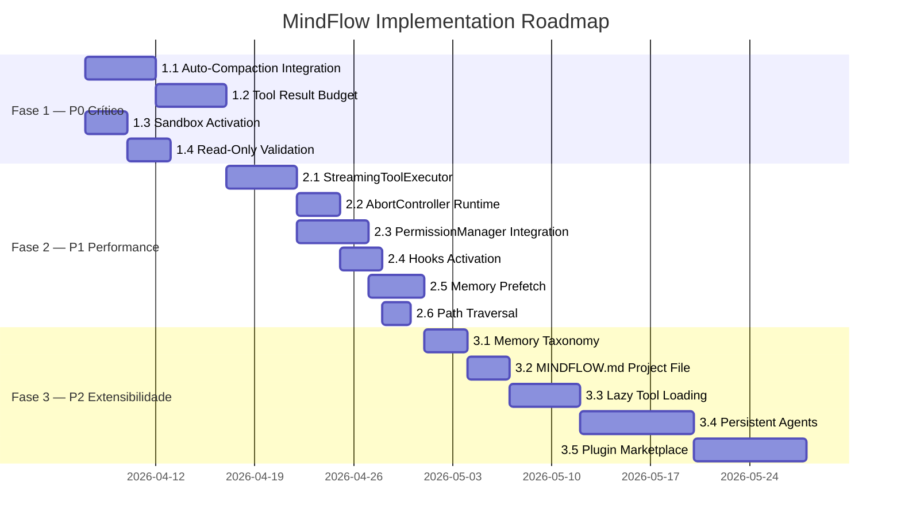

# 🗺️ Plano de Implementação — Gaps Identificados (Claude Code vs MindFlow)

> **Referência**: [Análise Comparativa Claude Code vs MindFlow](../../.gemini/antigravity/brain/c16ba9bf-7aea-41e0-95bc-2b5529081fd5/analise_comparativa_claude_vs_mindflow.md)
> **Data**: 2026-04-02
> **Autor**: Análise automatizada via SocratiCode MCP

---

## 📊 Resumo do Estado Atual

Após pesquisa profunda na codebase, **muitos gaps já possuem infraestrutura implementada** no MindFlow. O trabalho restante é de **integração, maturação e completude** — não de criação do zero.

### Legenda de Status

| Status | Significado |
|--------|-------------|
| 🟢 **INTEGRAR** | Infraestrutura existe, precisa de integração no runtime |
| 🟡 **AMADURECER** | Existe parcialmente, precisa de extensão/melhoria |
| 🔴 **CRIAR** | Não existe, precisa ser criado do zero |

### Inventário de Gaps

| # | Feature | Status Atual | Ação |
|---|---------|-------------|------|
| 1 | Auto-Compaction de Contexto | 🟢 INTEGRAR | `AutoCompactService` existe em `query/budget/auto_compact.py` — falta integrar no runtime loop |
| 2 | Tool Result Budget | 🟡 AMADURECER | `ContentReplacement` e `TokenBudget` existem — falta enforcement automático |
| 3 | Sandbox para Shell | 🟢 INTEGRAR | `DockerSandbox` + `MindFlowSandbox` + 20+ validators existem — falta ativar por padrão |
| 4 | Read-Only Validation | 🟢 INTEGRAR | `BashSecurityLevel` + `validate_bash_command()` existem — falta classifier semântico |
| 5 | Parallel Tool Executor | 🟢 INTEGRAR | `StreamingToolExecutor` existe em 2 implementações — falta uso no agent loop |
| 6 | AbortController Hierárquico | 🟢 INTEGRAR | `AbortController` com parent/children existe — falta propagação no runtime |
| 7 | Permission Rules Engine | 🟢 INTEGRAR | `PermissionManager` completo com 6 modos — falta wiring no agent loop |
| 8 | Hooks System | 🟢 INTEGRAR | 27 eventos, `HookManager`, `HookRegistry` completos — falta ativação no runtime |
| 9 | Memory Prefetch | 🔴 CRIAR | Não existe mecanismo de prefetch assíncrono |
| 10 | Path Traversal Validation | 🟢 INTEGRAR | `validate_path_traversal()` + `validate_filesystem_operation()` existem |
| 11 | Memory Taxonomy | 🟡 AMADURECER | `MemoryCategory` existe em storage — falta enforcement de tipos |
| 12 | MINDFLOW.md (Project File) | 🔴 CRIAR | Não existe equivalente de CLAUDE.md |
| 13 | Lazy Tool Schema Loading | 🔴 CRIAR | Schemas carregados eager — sem deferred loading |
| 14 | Persistent Agents | 🔴 CRIAR | Agentes morrem após task — sem conceito alive |
| 15 | Plugin Marketplace | 🔴 CRIAR | Sem sistema de plugins de terceiros |

---

## Fase 1 — Integração Crítica (P0)

> **Meta**: Ativar infraestrutura já existente no runtime loop
> **Estimativa**: 2-3 sprints
> **Foco**: Tornar o sistema seguro e estável para uso real

---

### 1.1 🔗 Integrar Auto-Compaction no Agent Runtime

**Status**: 🟢 INTEGRAR — `AutoCompactService` existe completo

**O que já existe**:
- `query/budget/auto_compact.py` — `AutoCompactService` com 4 estratégias (snip, cache, collapse, summary)
- `CompactConfig` com thresholds configuráveis (max_context_tokens=180k, target=128k)
- PTL retry (retry when prompt too long), circuit breaker, file state preservation
- `compact_with_cache_sharing()` para cache-aware compaction
- `create_post_compact_file_attachments()` para restaurar context após compact
- `query/budget/token_counter.py` — `TokenBudget` com tiktoken

**O que falta**:
1. Integrar `AutoCompactService.should_compact()` no agent loop principal
2. Chamar `compact()` automaticamente quando token count excede threshold
3. Emitir `PreCompactHandler` / `PostCompactHandler` hooks durante compaction
4. Implementar feedback via SSE quando compaction ocorre (informar frontend)
5. Adicionar métricas de compaction (tokens salvos, estratégia usada) no analytics

**Arquivos a modificar**:

| Arquivo | Mudança |
|---------|---------|
| `runtime/core/agent_runtime.py` | Adicionar `_check_and_compact()` no loop de processamento |
| `runtime/execution/executor.py` | Injetar `AutoCompactService` no `RuntimeExecutor` |
| `query/budget/auto_compact.py` | Integrar com `PreCompactHandler`/`PostCompactHandler` |
| `api/v1/streaming.py` | Emitir `StreamEvent` de tipo `compact_started`/`compact_completed` |

**Dependências**: Nenhuma (auto-contida)

**Critérios de Aceite**:
- [ ] Compaction dispara automaticamente quando context > `max_context_tokens`
- [ ] Hooks `PreCompact`/`PostCompact` são executados
- [ ] Frontend recebe notificação via SSE
- [ ] Sessões longas não degradam (teste: 50+ turns sem context overflow)
- [ ] Métricas de tokens salvos são registradas

---

### 1.2 🔗 Integrar Tool Result Budget

**Status**: 🟡 AMADURECER — schemas existem, falta enforcement

**O que já existe**:
- `schemas/tools/result.py` — `ContentReplacement` com `add_replacement()`, `has_replacements()`
- `query/budget/token_counter.py` — `TokenBudget` com `trim_to_fit()` e priority-based trimming
- `query/budget/token_budget_manager.py` — `TokenBudgetManager` para gerenciar budgets

**O que falta**:
1. Implementar `ToolResultBudget` que rastreia resultados de ferramentas na conversa
2. Quando context window cresce, substituir tool results antigos por `ContentReplacement` placeholders
3. Manter índice de resultados substituídos para possível re-fetch
4. Integrar com `AutoCompactService` como estratégia complementar

**Arquivos a criar/modificar**:

| Arquivo | Mudança |
|---------|---------|
| `query/budget/tool_result_budget.py` | **[NOVO]** — `ToolResultBudget` service |
| `schemas/tools/result.py` | Estender `ContentReplacement` com `restore()` |
| `runtime/execution/executor.py` | Injetar budget enforcement antes de cada LLM call |
| `query/budget/auto_compact.py` | Adicionar `TOOL_RESULT_TRIM` como 5ª estratégia |

**Pseudocódigo**:
```python
class ToolResultBudget:
    """Gerencia budget de resultados de ferramentas na conversa."""
    
    def __init__(self, max_tool_result_tokens: int = 50_000):
        self.max_tokens = max_tool_result_tokens
        self.replacement_state = ContentReplacement()
    
    def enforce(self, messages: list[dict]) -> list[dict]:
        """Substitui tool results antigos por placeholders quando budget excede."""
        tool_results = self._extract_tool_results(messages)
        total_tokens = sum(self._count_tokens(r) for r in tool_results)
        
        while total_tokens > self.max_tokens and tool_results:
            oldest = tool_results.pop(0)  # FIFO
            replacement_id = self.replacement_state.add_replacement(oldest["content"])
            oldest["content"] = f"[Tool result stored as {replacement_id}. Re-run tool if needed.]"
            total_tokens = sum(self._count_tokens(r) for r in tool_results)
        
        return messages
```

**Critérios de Aceite**:
- [ ] Tool results antigos são substituídos por placeholders
- [ ] Replacement IDs permitem re-fetch quando necessário
- [ ] Budget é aplicado antes de cada chamada LLM
- [ ] Funciona em conjunto com auto-compaction

---

### 1.3 🔗 Ativar Sandbox por Padrão para Shell Commands

**Status**: 🟢 INTEGRAR — toda infraestrutura existe

**O que já existe**:
- `security/sandbox/docker_sandbox.py` — `DockerSandbox` com isolamento completo
- `agents/tools/sandbox.py` — `MindFlowSandbox` com subprocess isolation
- `security/tools/shell_executor_v2.py` — `ShellExecutorToolV2` com Docker integration
- `agents/tools/callable/shell.py` — `ShellExecutorCallable` (Phase 3 callable tool)
- `agents/tools/workspace_security.py` — `validate_shell_command()`, `secure_sandbox_enabled()`
- `security/validators/bash_validators.py` — 14+ validators migrados
- `security/policies/network_policy.py` — `NetworkPolicy` com allow/deny domains
- `security/audit/security_logger.py` — `SecurityLogger` para auditoria

**O que falta**:
1. Tornar sandbox **obrigatório por padrão** (atualmente opt-in)
2. Configurar feature flag `MINDFLOW_SECURE_SANDBOX=true` como default
3. Integrar `ShellExecutorToolV2` (Docker) como executor padrão resolvido pelo router
4. Implementar fallback gracioso quando Docker não está disponível
5. Adicionar startup health check para Docker sandbox

**Arquivos a modificar**:

| Arquivo | Mudança |
|---------|---------|
| `config/settings.py` ou variáveis de ambiente | `SECURE_SANDBOX=true` como default |
| `agents/tools/workspace_security.py` | `secure_sandbox_enabled()` retorna `True` por padrão |
| `runtime/core/agent_runtime.py` | Health check de Docker no startup |
| `agents/tools/__init__.py` | Registrar `ShellExecutorToolV2` como provider padrão |
| `infra/startup.py` ou `main.py` | Verificar disponibilidade do Docker e emitir warning |

**Critérios de Aceite**:
- [ ] Sandbox Docker ativo por padrão em produção
- [ ] Fallback para subprocess sandbox com WARNING quando Docker não disponível
- [ ] Health check no startup verifica Docker + emite log
- [ ] Todos os shell commands passam por `validate_bash_command()` sempre
- [ ] Network policy aplicada por padrão

---

### 1.4 🔗 Integrar Read-Only Semantic Validation no Runtime

**Status**: 🟢 INTEGRAR — validators existem, falta classifier semântico

**O que já existe**:
- `schemas/tools/shell_schemas_v2.py` — `BashSecurityLevel` (SAFE/MODERATE/DANGEROUS/CRITICAL)
- `agents/tools/security/bash_validators.py` — 20+ validators incluindo:
  - Command injection, path traversal, dangerous commands
  - Eval-like detection, newline injection, IFS manipulation
  - jq system() blocking, binary hijack detection
  - AST-based command parsing (`bash_ast_parser.py`)
  - Windows pattern detection
- `agents/tools/callable/shell.py` — Read-only mode enforcement já existe
- `permissions/types.py` — `PermissionMode.PLAN` (read-only mode)

**O que falta**:
1. Implementar **semantic classifier** que analisa a intent do comando (READ vs WRITE)
2. Mapear comandos comuns para categorias de segurança automaticamente
3. Integrar classifier com `PermissionMode.ACCEPT_EDITS` para auto-aprovar reads
4. Adicionar read-only command whitelist extensível

**Arquivos a criar/modificar**:

| Arquivo | Mudança |
|---------|---------|
| `security/classifiers/command_intent.py` | **[NOVO]** — Classifier semântico de intent |
| `agents/tools/security/bash_validators.py` | Integrar com comando classifier |
| `permissions/manager.py` | Usar classifier no `check_permission()` para shell tools |

**Pseudocódigo**:
```python
class CommandIntentClassifier:
    """Classifica a intenção de comandos shell (READ vs WRITE vs DANGEROUS)."""
    
    SAFE_READ_COMMANDS = {
        "cat", "ls", "find", "grep", "head", "tail", "wc", "stat",
        "file", "type", "which", "echo", "pwd", "env", "date", "whoami",
        "du", "df", "tree", "less", "more", "diff", "sort", "uniq",
        "awk", "sed -n", "cut", "tr", "git log", "git status", "git diff",
        "git show", "git branch", "python --version", "node --version",
    }
    
    def classify(self, command: str) -> CommandIntent:
        base = shlex.split(command)[0] if command.strip() else ""
        if base in self.SAFE_READ_COMMANDS:
            return CommandIntent.READ_ONLY
        # Fallback: delegate to existing validators
        decision = validate_bash_command(command)
        if decision.security_level == BashSecurityLevel.SAFE:
            return CommandIntent.READ_ONLY
        return CommandIntent.WRITE
```

**Critérios de Aceite**:
- [ ] Comandos read-only são auto-aprovados em `ACCEPT_EDITS` mode
- [ ] Comandos write/dangerous passam pela permission chain normal
- [ ] Whitelist é extensível via configuração
- [ ] 100% dos existing validators continuam funcionando

---

## Fase 2 — Performance & Controle (P1)

> **Meta**: Melhorar performance e dar controle ao usuário
> **Estimativa**: 2-3 sprints
> **Dependências**: Fase 1 completa

---

### 2.1 🔗 Integrar StreamingToolExecutor no Agent Loop

**Status**: 🟢 INTEGRAR — 2 implementações existem

**O que já existe**:
- `schemas/tools/callable_executor.py` — `StreamingToolExecutor` (CallableTool-based)
  - Concurrent-safe parallel execution
  - Error propagation with sibling cancellation
  - `_sibling_abort_event` para cancelar siblings
- `runtime/execution/streaming_executor.py` — `StreamingToolExecutor` (runtime-level)
  - `TrackedTool` com state tracking (pending/executing/completed/errored)
  - `_result_queue` para resultados assíncronos
  - Hook integration (`HookManager.get_instance()`)
  - Semaphore-based concurrency control (`max_concurrent=5`)
- `runtime/execution/executor.py` — `execute_with_streaming()` method

**O que falta**:
1. Unificar as 2 implementações em uma única source of truth
2. Conectar `execute_with_streaming()` como **caminho padrão** de execução
3. Emitir `tool_started`/`tool_completed` SSE events para cada ferramenta
4. Adicionar métricas por ferramenta (latência, taxa de erro)

**Arquivos a modificar**:

| Arquivo | Mudança |
|---------|---------|
| `schemas/tools/callable_executor.py` | Deprecar em favor do runtime-level executor |
| `runtime/execution/streaming_executor.py` | Tornar o executor canônico |
| `runtime/execution/executor.py` | Usar `StreamingToolExecutor` como default |
| `api/v1/streaming.py` | Emitir SSE events de tool lifecycle |

**Critérios de Aceite**:
- [ ] Ferramentas concurrent-safe rodam em paralelo
- [ ] Errros em uma ferramenta cancelam siblings quando configurado
- [ ] SSE events de `tool_started`/`tool_completed` chegam ao frontend
- [ ] Métricas de latência por ferramenta são registradas
- [ ] Uma única implementação de `StreamingToolExecutor`

---

### 2.2 🔗 Integrar AbortController no Runtime

**Status**: 🟢 INTEGRAR — controller exists

**O que já existe**:
- `schemas/tools/streaming_types.py`:
  - `AbortController` com `parent`/`children` hierarchy
  - `abort()` propaga para filhos
  - `create_child()` cria controller filho
  - `check_or_raise()` levanta `ToolExecutionAbortedError`
  - `create_child_abort_controller()` factory
- `schemas/tools/context.py` — `ToolContext` com `abort_signal` e `abort_callback`
- `api/v1/tasks.py` — `cancel_task()` endpoint

**O que falta**:
1. Criar `AbortController` root por sessão no `AgentRuntime`
2. Propagar child controllers para cada subagente e ferramenta
3. Conectar `cancel_task()` API ao `AbortController.abort()`
4. Adicionar WebSocket channel para cancelamento real-time do frontend
5. Implementar graceful shutdown (aguardar tool blocks antes de abortar)

**Arquivos a modificar**:

| Arquivo | Mudança |
|---------|---------|
| `runtime/core/agent_runtime.py` | Criar root `AbortController` por sessão |
| `runtime/execution/executor.py` | Propagar child controllers |
| `api/v1/tasks.py` | Conectar cancel ao `AbortController.abort()` |
| `api/v1/websocket.py` | **[NOVO ou MODIFICAR]** — Canal de cancelamento |

**Critérios de Aceite**:
- [ ] Cancelar task via API aborta todas as ferramentas em execução
- [ ] Subagentes recebem child controllers
- [ ] Tools com `interrupt_behavior="block"` aguardam conclusão
- [ ] Tools com `interrupt_behavior="cancel"` são canceladas imediatamente
- [ ] Frontend pode cancelar via WebSocket

---

### 2.3 🔗 Integrar PermissionManager no Agent Loop

**Status**: 🟢 INTEGRAR — sistema completo existe

**O que já existe**:
- `permissions/manager.py` — `PermissionManager` completo com:
  - 6 modos: AUTO, PLAN, DEFAULT, ACCEPT_EDITS, BYPASS, DONT_ASK
  - Evaluation order: deny rules → ask rules → mode → tool check → allow rules → default ask
  - Circuit breaker para resilience
  - Pattern matching support (wildcards)
- `permissions/types.py` — `PermissionMode`, `PermissionBehavior`
- `schemas/tools/permission.py` — `PermissionResult`, `PermissionRule`
- `schemas/tools/tool_permissions.py` — `ToolPermissionSet`

**O que falta**:
1. Integrar `PermissionManager.check_permission()` no `StreamingToolExecutor`
2. Implementar SSE-based permission prompt para frontend (behavior=ASK)
3. Aguardar resposta do usuário via WebSocket quando `ASK` é retornado
4. Persistir regras "always allow" / "always deny" em config do usuário
5. Configurar modo default por sessão na criação

**Arquivos a modificar**:

| Arquivo | Mudança |
|---------|---------|
| `runtime/execution/streaming_executor.py` | Chamar `check_permission()` antes de executar |
| `runtime/core/agent_runtime.py` | Injetar `PermissionManager` com modo padrão |
| `api/v1/permissions.py` | **[NOVO]** — API para responder prompts |
| `api/v1/streaming.py` | Emitir `permission_request` SSE event |

**Critérios de Aceite**:
- [ ] Ferramentas passam por permission check antes de executar
- [ ] Modo BYPASS permite tudo mas emite warning
- [ ] Modo DEFAULT prompt no frontend via SSE
- [ ] Regras "always allow" persistem entre sessões
- [ ] Modo PLAN bloqueia todas as ferramentas write

---

### 2.4 🔗 Integrar Hooks System no Runtime

**Status**: 🟢 INTEGRAR — sistema completo com 27 eventos

**O que já existe**:
- `hooks/__init__.py` — Sistema completo v1.0.0
- `hooks/types.py` — `HookEvent` com 27 eventos (paridade com Claude Code + extensões MindFlow)
- `hooks/manager.py` — `HookManager` singleton com `execute_pre_tool()`, `execute_post_tool()`
- `hooks/registry.py` — `HookRegistry` com config hooks, plugin hooks, agent hooks
- `hooks/context.py` — `HookContext` com todos os campos necessários
- `hooks/result.py` — `HookResult`, `AggregatedHookResult`, `HookCommand`, `HookMatcher`
- `hooks/event_broadcaster.py` — `HookEventBroadcaster` para UI events
- `hooks/handlers/` — 17 handlers implementados:
  - `PreToolUseHandler`, `PostToolUseHandler`, `PostToolFailureHandler`
  - `SessionStartHandler`, `SessionEndHandler`, `StopHandler`
  - `PreCompactHandler`, `PostCompactHandler`
  - `PermissionRequestHandler`, `PermissionDeniedHandler`
  - `TaskCreatedHandler`, `TaskCompletedHandler`
  - `FileChangedHandler`, `CwdChangedHandler`
  - `UserPromptSubmitHandler`, `ConfigChangeHandler`, `SetupHandler`
- `tests/unit/hooks/test_hooks.py` — Testes unitários

**O que falta**:
1. Chamar `PreToolUseHandler.execute()` antes de cada tool execution
2. Chamar `PostToolUseHandler.execute()` após cada tool execution
3. Chamar `SessionStartHandler.execute()` no início de cada sessão
4. Integrar `HookEventBroadcaster.emit()` com SSE stream
5. Documentar como usuários configuram hooks customizados

**Arquivos a modificar**:

| Arquivo | Mudança |
|---------|---------|
| `runtime/execution/streaming_executor.py` | Apenas inserir chamadas aos handlers (já importa `HookManager`) |
| `runtime/core/agent_runtime.py` | Chamar `SessionStartHandler` e `SessionEndHandler` |
| `api/v1/streaming.py` | Registrar handler no `HookEventBroadcaster` |

**Critérios de Aceite**:
- [ ] Pre/Post tool hooks executam para cada ferramenta
- [ ] Hook com exit_code=2 bloqueia execução da ferramenta
- [ ] Session hooks executam no início/fim
- [ ] Event broadcaster emite para SSE stream
- [ ] Testes existentes passam

---

### 2.5 🔴 Criar Memory Prefetch Assíncrono

**Status**: 🔴 CRIAR — não existe

**O que já existe (base)**:
- `memory/facade.py` — `MemoryFacade` com recall methods
- `memory/services/session_memory.py` — `SessionMemoryService`
- `memory/recall/` — Sistema de recall com scoring

**O que criar**:

| Arquivo | Tipo | Descrição |
|---------|------|-----------|
| `memory/prefetch.py` | **[NOVO]** | `MemoryPrefetch` — busca assíncrona de memórias |
| `runtime/core/agent_runtime.py` | MODIFICAR | Iniciar prefetch em paralelo com streaming |

**Design**:
```python
class MemoryPrefetch:
    """Busca memórias em background enquanto o agent streama."""
    
    def __init__(self, memory_facade: MemoryFacade):
        self._facade = memory_facade
        self._task: asyncio.Task | None = None
        self._result: list[MemoryRecallHit] | None = None
        self._settled = False
    
    def start(self, query: str, session_id: str, scope: MemoryScope):
        """Inicia busca em background."""
        self._task = asyncio.create_task(
            self._fetch(query, session_id, scope)
        )
    
    async def consume(self, timeout: float = 2.0) -> list[MemoryRecallHit]:
        """Aguarda resultado ou retorna vazio após timeout."""
        if self._result is not None:
            return self._result
        if self._task is None:
            return []
        try:
            self._result = await asyncio.wait_for(self._task, timeout)
            self._settled = True
            return self._result
        except asyncio.TimeoutError:
            return []
    
    async def _fetch(self, query, session_id, scope):
        return await self._facade.recall_memories(
            query=query, session_id=session_id, scope=scope
        )
```

**Critérios de Aceite**:
- [ ] Prefetch inicia em paralelo com o primeiro token do streaming
- [ ] Resultado disponível sem bloquear o agent
- [ ] Timeout de 2s retorna vazio sem error
- [ ] Métricas: latência do prefetch, hit rate

---

### 2.6 🟢 Integrar Path Traversal Validation em File Tools

**Status**: 🟢 INTEGRAR — validators existem

**O que já existe**:
- `agents/tools/security/filesystem_validators.py`:
  - `validate_path_traversal_filesystem()` com workspace boundary check
  - `validate_symlink()` com TOCTOU protection
  - `validate_device_file()` blocking
  - `validate_file_size()` (1GB limit)
  - `validate_secrets()` para prevenção de leak
  - `validate_filesystem_operation()` — master validator
- V2 tools (`GlobToolV2`, `GrepToolV2`) já chamam `validate_filesystem_operation()`

**O que falta**:
1. Garantir que **todos** os file tools (v1, v2, callable) passam pelo master validator
2. Integrar `workspace_root` em todos os `ToolContext` instances
3. Adicionar `validate_symlink()` nas CallableTool de filesystem

**Critérios de Aceite**:
- [ ] Todos os file tools passam por `validate_filesystem_operation()`
- [ ] `workspace_root` é propagado em todos os `ToolContext`
- [ ] Symlink validation ativa em todos os file reads/writes
- [ ] Paths fora do workspace são bloqueados

---

## Fase 3 — Extensibilidade & Polish (P2)

> **Meta**: Tornar o sistema extensível e polido
> **Estimativa**: 3-4 sprints
> **Dependências**: Fases 1 e 2 completas

---

### 3.1 🟡 Amadurecer Memory Taxonomy

**Status**: 🟡 AMADURECER — modelo de storage existe

**O que já existe**:
- `memory/storage/models.py` — `MemoryCategory` (project-level categories)
- `memory/facade.py` — `_infer_category()` com regras estáticas

**O que falta**:
1. Definir taxonomia estrita: `preferences`, `decisions`, `solutions`, `patterns`, `context`
2. Implementar validação de tipo em `MemoryFacade.store_memory()`
3. Adicionar `memory_type` field no recall para filtragem
4. Implementar memory scoring por tipo (decisions > preferences em weight)
5. Adicionar regras de exclusão (não salvar: git diffs, file contents verbatim, errors temporários)

**Critérios de Aceite**:
- [ ] Memórias são classificadas em 5 tipos
- [ ] Recall pode filtrar por tipo
- [ ] Scoring pondera por tipo
- [ ] Informação derivável (git history, code content) não é salva

---

### 3.2 🔴 Criar MINDFLOW.md — Arquivo de Instruções por Projeto

**Status**: 🔴 CRIAR

**Design**:
- Arquivo `MINDFLOW.md` na raiz de qualquer projeto
- Lido automaticamente no `SessionStart`
- Injetado no system prompt como contexto de projeto
- Suporte a hierarquia: `~/.mindflow/MINDFLOW.md` (global) + `$PROJECT/MINDFLOW.md` (local)
- Instruções de projeto (padrões, convenções, restrições)

| Arquivo | Tipo | Descrição |
|---------|------|-----------|
| `config/project_instructions.py` | **[NOVO]** | `ProjectInstructionsLoader` |
| `agents/prompts/segments/project_context.py` | **[NOVO]** | Prompt segment para MINDFLOW.md |
| `hooks/handlers/instructions_loaded.py` | MODIFICAR | Chamar loader no `InstructionsLoadedHandler` |

**Critérios de Aceite**:
- [ ] MINDFLOW.md é descoberto automaticamente
- [ ] Conteúdo injetado no system prompt
- [ ] Hierarquia: global → projeto → subdiretório
- [ ] Hook `InstructionsLoaded` é emitido

---

### 3.3 🔴 Criar Lazy Tool Schema Loading

**Status**: 🔴 CRIAR

**Design**:
- Tools MCP registram apenas name + description (sem schema completo)
- Schema completo carregado sob demanda quando model solicita a ferramenta
- `ToolSearchTool` para buscar ferramentas por query semântica
- Reduz context window em ~20-30% para muitas ferramentas

| Arquivo | Tipo | Descrição |
|---------|------|-----------|
| `schemas/mcp/tools/deferred.py` | **[NOVO]** | `DeferredToolSchema` com lazy loading |
| `agents/tools/search.py` | **[NOVO]** | `ToolSearchTool` para discovery |
| `schemas/mcp/tools/tool.py` | MODIFICAR | Suportar `tool_reference` mode |

**Critérios de Aceite**:
- [ ] Schemas não carregados até necessários
- [ ] `ToolSearchTool` retorna ferramentas por query
- [ ] Context window reduz significativamente com muitas tools

---

### 3.4 🔴 Criar Persistent Agents

**Status**: 🔴 CRIAR

**Design inspirado no Claude Code `runInProcessTeammate()`**:
- Agentes que permanecem vivos recebendo múltiplos prompts
- Loop de execução persistente com mailbox
- Graceful shutdown via `AbortController`

| Arquivo | Tipo | Descrição |
|---------|------|-----------|
| `runtime/persistent/agent_pool.py` | **[NOVO]** | `PersistentAgentPool` manager |
| `runtime/persistent/agent_loop.py` | **[NOVO]** | `PersistentAgentLoop` com mailbox |
| `communication/mailbox.py` | MODIFICAR | Suportar persistent agents |

**Critérios de Aceite**:
- [ ] Agents sobrevivem entre user turns
- [ ] Pool gerencia lifecycle dos agents
- [ ] Graceful shutdown via AbortController

---

### 3.5 🔴 Criar Plugin Marketplace Foundation

**Status**: 🔴 CRIAR

**Design**:

| Arquivo | Tipo | Descrição |
|---------|------|-----------|
| `plugins/registry.py` | **[NOVO]** | `PluginRegistry` |
| `plugins/loader.py` | **[NOVO]** | `PluginLoader` (pip/local) |
| `plugins/manifest.py` | **[NOVO]** | `PluginManifest` schema |
| `api/v1/plugins.py` | **[NOVO]** | API de gestão de plugins |

**Critérios de Aceite**:
- [ ] Plugins podem registrar ferramentas, hooks, e prompts
- [ ] API de listagem/instalação/remoção
- [ ] Manifest schema com dependências

---

## 📅 Cronograma Sugerido



---

## 🧪 Estratégia de Testes

### Testes por Feature

| Feature | Tipo de Teste | Cobertura |
|---------|--------------|-----------|
| Auto-Compaction | Unit + Integration | 50+ turn sessions sem overflow |
| Tool Result Budget | Unit | Budget enforcement, placeholder creation |
| Sandbox | Integration | Docker execution, fallback behavior |
| Read-Only Validation | Unit | Command classification accuracy |
| StreamingToolExecutor | Unit + Integration | Parallel execution, error propagation |
| AbortController | Unit | Hierarchy propagation, graceful shutdown |
| PermissionManager | Unit + E2E | All 6 modes, permission prompts |
| Hooks | Unit (existem!) | Handler execution, exit code behavior |
| Memory Prefetch | Unit | Timeout behavior, cache hit rate |
| Path Traversal | Unit | Boundary detection, symlink blocking |

### Benchmark Targets

| Métrica | Antes | Depois |
|---------|-------|--------|
| Max session turns (sem degradação) | ~15 | 50+ |
| Shell command security coverage | ~60% | 95%+ |
| Tool execution parallelism | 1x | 3-5x |
| Context window utilization | Unbounded | < 180k tokens |
| Permission check latency | N/A | < 10ms |

---

## 🏁 Definição de Done

Para cada feature:

1. ✅ Código implementado seguindo padrões do codebase (type hints, docstrings, `from __future__ import annotations`)
2. ✅ Testes unitários com cobertura ≥ 80%
3. ✅ Integração com o runtime loop principal
4. ✅ SSE events emitidos para frontend quando aplicável
5. ✅ Métricas e logging via `get_logger(__name__)`
6. ✅ Documentação em docstrings
7. ✅ Sem breaking changes nos endpoints existentes
