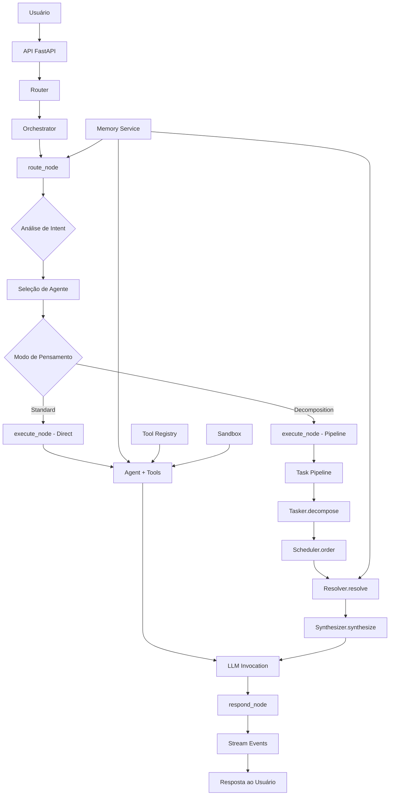
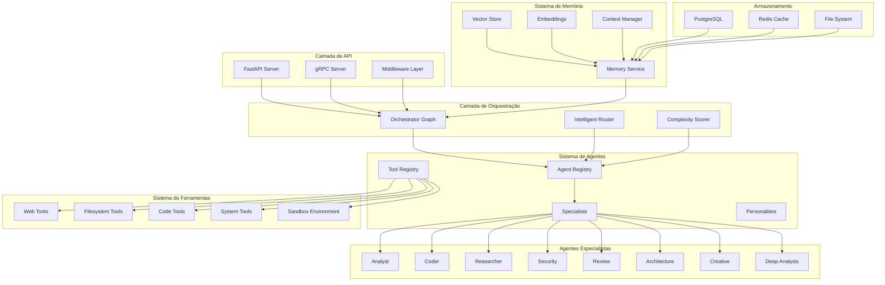
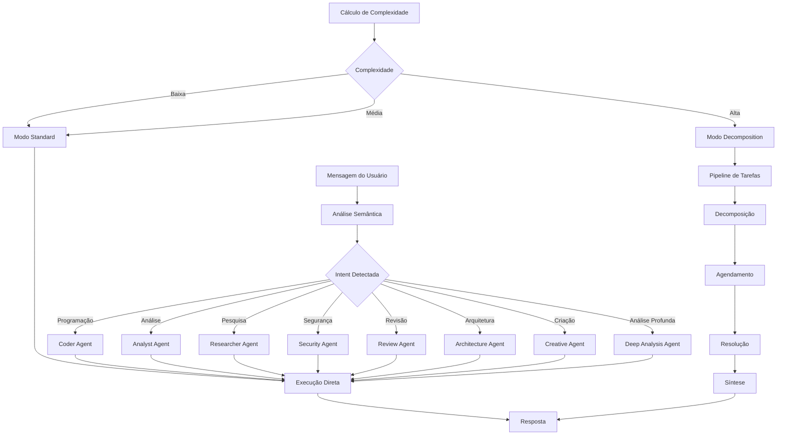
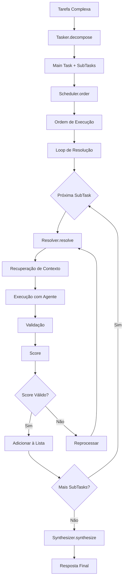
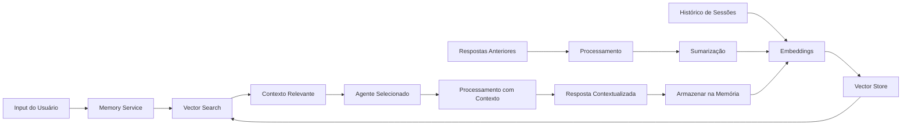
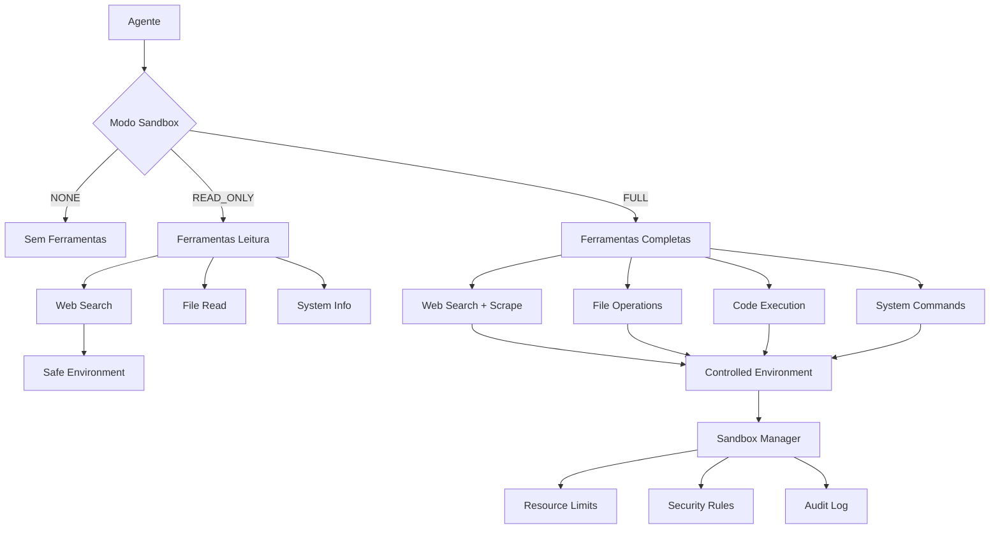
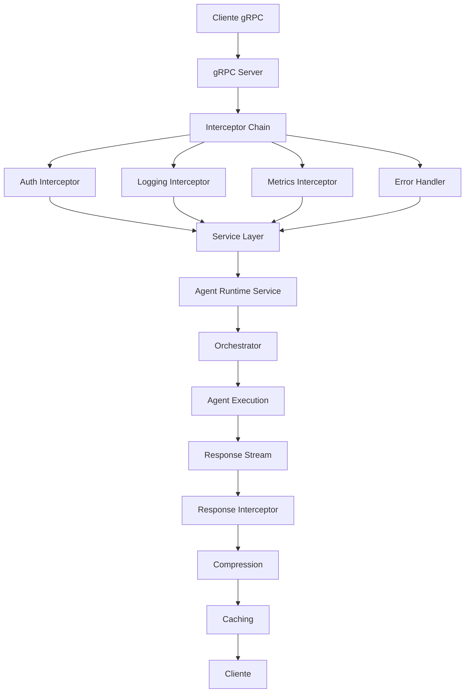
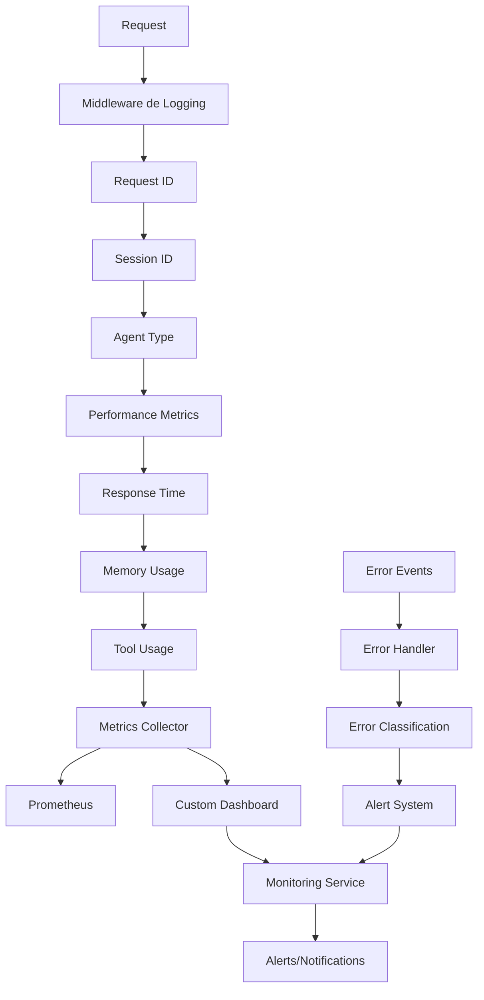

# Diagrama de Fluxo do Sistema de Agentes MindFlow

## Fluxo Principal de Execução

## Arquitetura de Componentes

## Fluxo de Decisão do Orquestrador

## Pipeline de Decomposição de Tarefas

## Sistema de Memória e Contexto

## Sistema de Ferramentas e Sandbox

## Fluxo de Comunicação gRPC

## Monitoramento e Observabilidade

