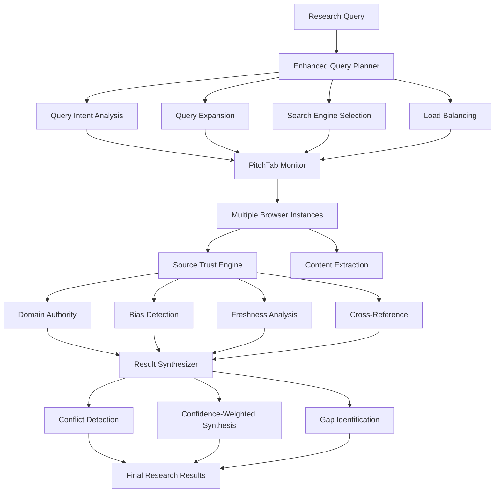

# Enhanced Research Agent Architecture

## Overview

The Enhanced Research Agent provides comprehensive research capabilities using PinchTab browser automation with advanced query planning, source trust evaluation, and intelligent result synthesis.

## Architecture Components

### 🔧 Core Components

#### 1. **Enhanced Query Planner** (`enhanced_query_planner.py`)
- **Query Expansion**: Generates multiple query variants based on question type
- **Search Engine Selection**: Intelligent selection based on query domain
- **Load Balancing**: Distributes queries across multiple browser instances
- **Complexity Assessment**: Determines optimal resource allocation

**Features:**
- Support for 8 question types (Definition, Tutorial, Comparison, etc.)
- Automatic query expansion with up to 5 variants
- Domain-specific search engine selection
- Resource optimization based on complexity

#### 2. **Source Trust Engine** (`source_trust_engine.py`)
- **Domain Authority**: Pre-computed authority scores for known domains
- **Content Freshness**: Detects temporal relevance and outdated information
- **Bias Detection**: Identifies promotional, clickbait, and opinionated content
- **Cross-Reference Validation**: Validates facts across multiple sources

**Trust Signals:**
- Domain authority (40% weight)
- Content freshness (20% weight)
- Bias score (20% weight)
- Cross-reference validation (20% weight)

#### 3. **Result Synthesizer** (`result_synthesizer.py`)
- **Conflict Detection**: Identifies contradictions between sources
- **Confidence-Weighted Synthesis**: Prioritizes high-confidence sources
- **Automatic Citation Formatting**: Formats citations based on source type
- **Gap Identification**: Identifies missing information types

**Output Features:**
- Structured summary with confidence levels
- Conflict resolution and analysis
- Comprehensive gap identification
- Actionable recommendations

#### 4. **PitchTab Monitor** (`pitchtab_monitor.py`)
- **Process Management**: Start/stop/restart browser instances
- **Health Monitoring**: Resource usage and vital status tracking
- **Auto-Recovery**: Automatic restart of failed instances
- **Orphan Cleanup**: Detection and cleanup of orphaned processes

**Monitoring Features:**
- CPU and memory usage tracking
- Response time monitoring
- Consecutive failure detection
- Automatic recovery mechanisms

### 🛡️ Security & Infrastructure

#### 5. **Port Manager** (`utils/port_manager.py`)
- **Port Allocation**: Automatic port assignment from configurable range
- **Conflict Prevention**: Ensures no duplicate port usage
- **Lock Management**: Thread-safe port operations
- **Status Tracking**: Real-time port utilization monitoring

#### 6. **Health Checker** (`utils/health_checker.py`)
- **Process Vitality**: Comprehensive health status tracking
- **Resource Monitoring**: CPU, memory, and performance metrics
- **Alerting**: Automatic detection of unhealthy states
- **Historical Tracking**: Health trends and patterns

## Integration Flow



## Usage Examples

### Basic Research

```python
from omnimind_backend.agents.research import get_enhanced_researcher_agent

# Initialize researcher
researcher = await get_enhanced_researcher_agent()
await researcher.initialize("session_001", "agent_001")

# Execute research
response = await researcher.execute_research(
    query="What is microservice architecture?",
    config=ResearchConfig(max_concurrent_browsers=3)
)

if response.success:
    print(f"Summary: {response.result.synthesis_summary}")
    print(f"Confidence: {response.result.confidence_level}")
```

### Advanced Configuration

```python
# High-complexity research with maximum resources
config = ResearchConfig(
    max_concurrent_browsers=8,
    enable_stealth_mode=True,
    headless_mode=True,
    preferred_search_engines=[
        "google.com", "scholar.google.com", "github.com"
    ]
)

response = await researcher.execute_research(
    query="Comprehensive analysis of distributed systems architecture patterns",
    config=config
)
```

### Monitoring Integration

```python
from omnimind_backend.agents.research.pitchtab_monitor import get_pitchtab_monitor

# Start monitoring
monitor = get_pitchtab_monitor()
await monitor.start_monitoring()

# Check status
status = monitor.get_monitoring_status()
print(f"Healthy instances: {status['health_monitoring']['healthy_processes']}")
```

## Question Types Supported

| Type | Description | Complexity | Browser Count | Example |
|-------|-------------|-------------|---------------|---------|
| DEFINITION | "What is X?" | Simple-Moderate | 1-2 | "What is REST API?" |
| TUTORIAL | "How to X?" | Moderate | 2-3 | "How to set up Docker?" |
| COMPARISON | "X vs Y?" | Moderate-Complex | 2-4 | "React vs Vue" |
| CURRENT_STATE | "Latest X?" | Simple-Moderate | 1-2 | "Latest React version" |
| DEBUG | "Why X fails?" | Complex-Deep | 3-6 | "Why app crashes?" |
| DOCUMENTATION | "API docs for X" | Simple-Moderate | 1-2 | "FastAPI middleware docs" |
| INFORMATIONAL_DATA | "Stats on X" | Moderate-Complex | 2-4 | "Python usage statistics" |
| GENERAL | Open-ended | Simple-Moderate | 1-3 | "Tell me about AI" |

## Source Classification

| Type | Trust Level | Examples | Weight |
|-------|-------------|----------|--------|
| OFFICIAL | High | docs.python.org, developer.mozilla.org | 1.0 |
| ACADEMIC | High | arxiv.org, scholar.google.com | 0.9 |
| REPUTABLE_COMMUNITY | Medium | stackoverflow.com, github.com | 0.8 |
| TECH_PUBLICATION | Medium | medium.com, dev.to | 0.7 |
| UNKNOWN_BLOG | Low | Personal blogs, unknown sites | 0.5 |
| SOCIAL | Low | twitter.com, reddit.com | 0.3 |

## Performance Metrics

### Target Performance
- **Instance Creation**: < 5 seconds
- **Health Check**: < 2 seconds  
- **Query Planning**: < 1 second
- **Source Evaluation**: < 3 seconds
- **Result Synthesis**: < 2 seconds

### Resource Limits
- **Max Concurrent Browsers**: 10 (configurable)
- **Port Range**: 9867-9967 (100 ports)
- **Memory per Instance**: < 1GB
- **CPU per Instance**: < 90%

## Security Features

### Port Management
- ✅ No duplicate port allocation
- ✅ Automatic port release on cleanup
- ✅ Port conflict detection
- ✅ Real-time utilization tracking

### Process Security
- ✅ Process health monitoring
- ✅ Automatic failure recovery
- ✅ Orphan process cleanup
- ✅ Resource usage limits

### Data Security
- ✅ Source trust validation
- ✅ Bias detection
- ✅ Cross-reference verification
- ✅ Content freshness validation

## Configuration

### Environment Variables
```bash
# Default configuration
OMNIMIND_MAX_BROWSERS=5
OMNIMIND_DEFAULT_TIMEOUT=30
OMNIMIND_ENABLE_STEALTH=true
OMNIMIND_HEADLESS_MODE=true
```

### Settings Override
```python
config = ResearchConfig(
    max_concurrent_browsers=5,
    default_timeout_seconds=30,
    enable_stealth_mode=True,
    headless_mode=True,
    preferred_search_engines=[
        "google.com", "duckduckgo.com", "brave.com"
    ]
)
```

## Error Handling

### Graceful Degradation
- Automatic fallback to lower browser counts
- Service degradation on resource exhaustion
- Partial result delivery on failures
- Comprehensive error logging

### Recovery Mechanisms
- Automatic instance restart
- Port reallocation on conflicts
- Health check retry with exponential backoff
- Graceful shutdown on critical failures

## Testing

### Unit Tests
- Component isolation testing
- Mock-based integration testing
- Performance benchmarking
- Error scenario testing

### Integration Tests
- End-to-end workflow testing
- Multi-browser coordination testing
- Resource limit testing
- Failure recovery testing

Run tests:
```bash
cd python && python -m pytest tests/test_enhanced_researcher_integration.py -v
```

## Monitoring & Debugging

### Health Endpoints
- `/research/health` - Overall system health
- `/research/ports` - Port utilization status
- `/research/instances` - Browser instance status
- `/research/metrics` - Performance metrics

### Logging Levels
- **INFO**: Normal operations
- **WARNING**: Resource issues, degraded performance
- **ERROR**: Failures, exceptions
- **DEBUG**: Detailed execution flow

## Future Enhancements

### Planned Features
- [ ] Machine learning for query optimization
- [ ] Advanced content analysis with NLP
- [ ] Distributed research coordination
- [ ] Research result caching
- [ ] Custom source trust scoring
- [ ] Real-time collaboration support

### Scalability Improvements
- [ ] Horizontal scaling support
- [ ] Cloud browser integration
- [ ] Load balancing across nodes
- [ ] Persistent research sessions
- [ ] Research history management
